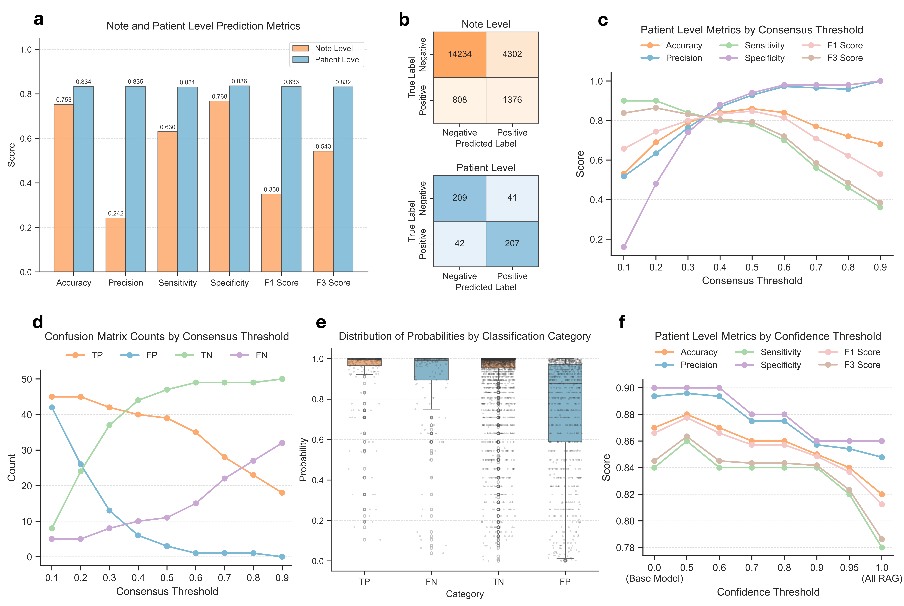
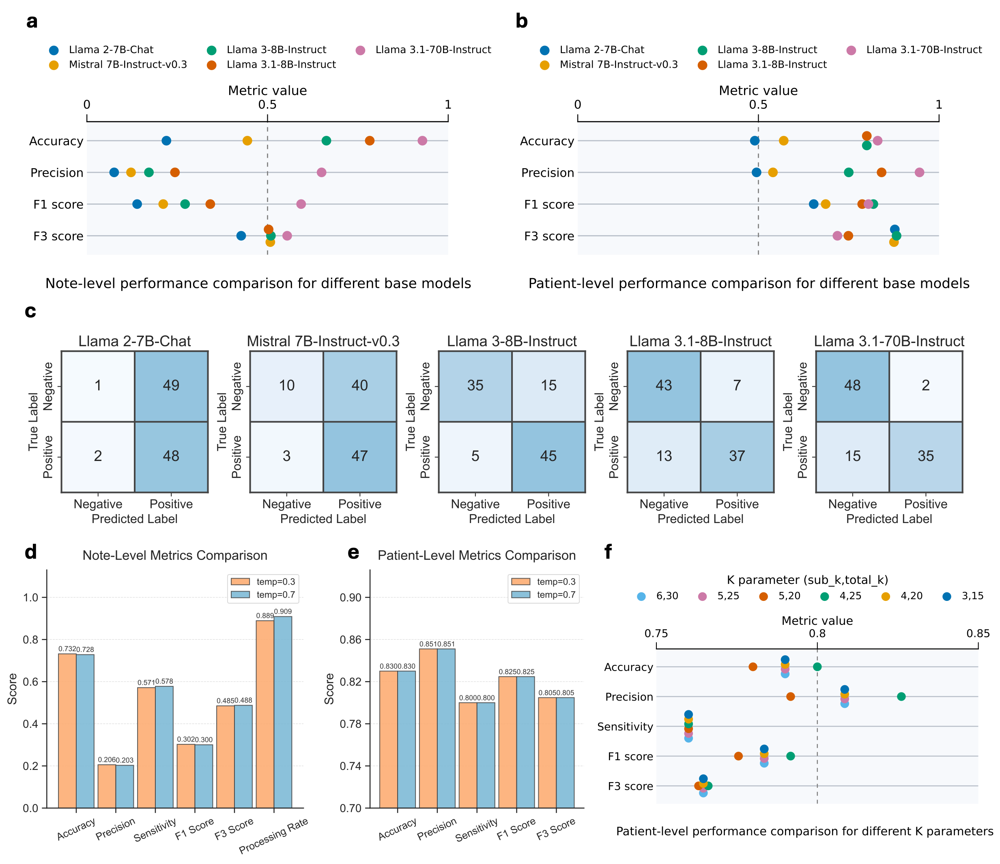

# 🧬 LLM-based Aortopathy Flagging

**[Leveraging Open-Source Large Language Models to Identify Undiagnosed Patients with Rare Genetic Aortopathies](https://www.medrxiv.org/content/10.1101/2025.09.05.25333227v2)**

Pankhuri Singhal\*, Zilinghan Li\*, Ze Yang\*, Tarak Nandi, Colleen Morse, Zachary Rodriguez, Alex Rodriguez, Volodymyr Kindratenko, Giorgio Sirugo, Reed E. Pyeritz, Theodore Drivas, Ravi Madduri, Anurag Verma

*University of Pennsylvania · Argonne National Laboratory · University of Illinois Urbana-Champaign*

---

## Overview

Rare genetic aortopathies (e.g., Marfan syndrome, Loeys-Dietz syndrome) are frequently undiagnosed until a life-threatening cardiac event. This repository contains an end-to-end open-source LLM pipeline that screens free-text clinical notes and recommends patients for genetic testing, designed for deployment within secure, privacy-compliant clinical computing environments.

The pipeline uses **Llama 3.1-8B-Instruct** as the base model and incorporates:
- **Confidence-based RAG**: retrieves relevant passages from a curated aortopathy literature corpus for low-confidence predictions
- **Consensus-based aggregation**: aggregates note-level recommendations across a patient's longitudinal record into a final patient-level recommendation
- **Captum interpretability**: token-level attribution highlighting which clinical terms drove each recommendation

## Results

<p align="center">
  
</p>

Evaluated on 22,510 clinical notes from 500 patients (250 cases, 250 controls) from the Penn Medicine BioBank:

| Level | Accuracy | Sensitivity | Specificity | Precision | F1 | F3 |
|---|---|---|---|---|---|---|
| Note | 0.753 | 0.630 | 0.768 | 0.242 | 0.350 | 0.543 |
| Patient | 0.834 | 0.831 | 0.836 | 0.835 | 0.833 | 0.832 |

Patient-level aggregation substantially improves over note-level performance, reflecting how longitudinal context supports more robust diagnostic reasoning.

<p align="center">
  
</p>


## Repository structure

```
finetune/           # Fine-tuning and inference (see finetune/README)
rag/                # RAG pipeline — document ingestion and note augmentation (see rag/README)
interpretability/   # Captum attribution scripts and HTML visualizations (see interpretability/README)
notebooks/          # Jupyter notebooks and output parsing utilities
plot/               # Manuscript figure generation scripts
```

## Citation

```bibtex
@article{singhal2025leveraging,
  title={Leveraging Open-Source Large Language Models to Identify Undiagnosed Patients with Rare Genetic Aortopathies},
  author={Singhal, Pankhuri and Li, Zilinghan and Yang, Ze and Nandi, Tarak and Morse, Colleen and Rodriguez, Zachary and Rodriguez, Alex and Kindratenko, Volodymyr and Sirugo, Giorgio and Pyeritz, Reed E and Drivas, Theodore and Madduri, Ravi and Verma, Anurag},
  journal={medRxiv},
  year={2025},
  doi={10.1101/2025.09.05.25333227}
}
```
